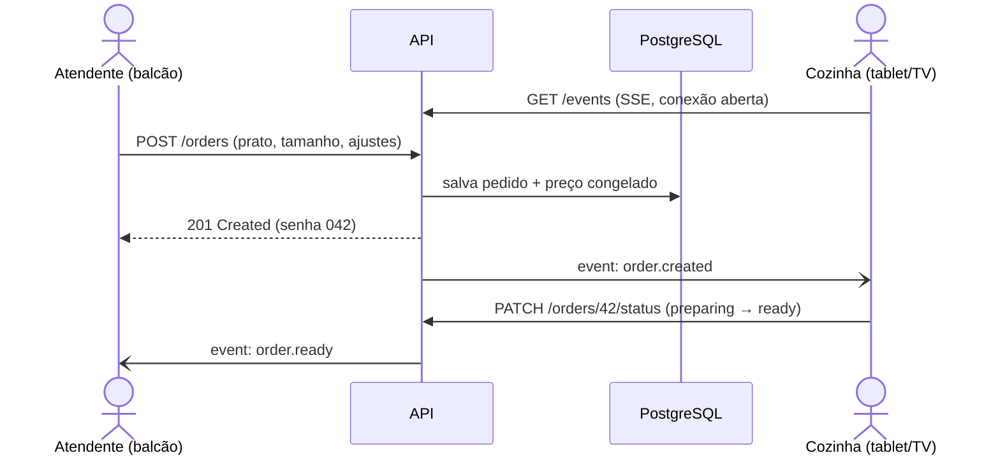
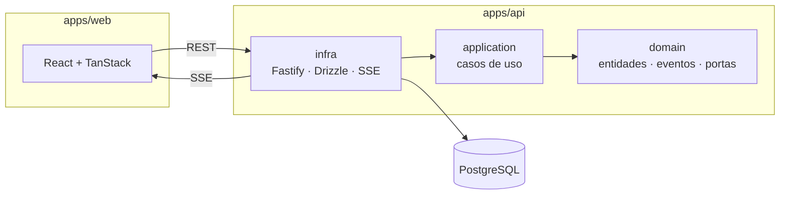

# marmitaria-os

> Sistema de fila de pedidos para marmitaria: o atendente registra o pedido no balcão e a
> cozinha recebe na hora, em ordem de chegada. Sem papel, sem grito, sem pedido perdido.


---

## Sumário

- [O problema](#o-problema)
- [A solução](#a-solução)
- [Funcionalidades](#funcionalidades)
- [Como funciona](#como-funciona)
- [Dispositivos](#dispositivos)
- [Stack](#stack)
- [Arquitetura](#arquitetura)
- [Estrutura do repositório](#estrutura-do-repositório)
- [Qualidade e entrega](#qualidade-e-entrega)
- [Roadmap](#roadmap)
- [Decisões de arquitetura](#decisões-de-arquitetura)
- [Como rodar](#como-rodar)

---

## O problema

Este projeto nasce de uma marmitaria real, de família. O fluxo de hoje:

1. O cliente chega ao balcão e diz qual marmita quer.
2. O atendente anota num **bloco de papel**, destaca a folha e **grita para a cozinha**.
3. Ao mesmo tempo, responde os pedidos do **WhatsApp** à mão e repete o processo.

Consequências:

- **Ponto único de falha:** tudo depende da memória e da voz de uma pessoa.
- **Pedidos perdidos ou errados:** papel some, letra fica ilegível, grito não é ouvido.
- **Sem ordem clara:** a cozinha não sabe o que chegou primeiro nem o que já saiu.
- **Sem dados:** ninguém sabe quantas marmitas saíram, quanto foi vendido ou qual prato vende mais.

## A solução

Uma fila digital de pedidos, pensada para **não deixar o atendimento mais lento**: registrar
um pedido deve levar **2–3 toques**. Se for mais demorado que o papel, o papel volta.

- O dono monta o **cardápio do dia** (ou da semana) com os pratos cadastrados.
- No balcão, o atendente escolhe **prato + tamanho**, marca as **trocas** ("farofa → salada")
  e envia.
- A **cozinha** vê o pedido aparecer em tempo real e avança o status até a entrega.
- Tudo fica salvo, alimentando um **dashboard** de pedidos e faturamento.

## Funcionalidades

### MVP — fila de pedidos

- Cadastro de pratos e de preços por tamanho (P / M / G).
- Cardápio do dia, com planejamento antecipado e cópia de semanas anteriores.
- Tela do balcão com ajustes rápidos (um toque) e observação livre.
- Tela da cozinha com a fila em tempo real: `recebido → em preparo → pronto → entregue`.
- Senha diária sequencial (001, 002…).
- Origem do pedido (balcão ou WhatsApp), registrada manualmente no início.

### Fase 2 — gestão

- Dashboard: pedidos do dia, faturamento, ticket médio, vendas por prato, tamanho e horário.
- Trocas mais pedidas e tempo médio de preparo.
- Prato esgotado bloqueado no balcão.

### Fase 3 — WhatsApp

- Pedidos do WhatsApp entram no sistema para confirmação do atendente.
- Aviso automático de "pedido pronto" para o cliente.

**Fora de escopo:** pagamento online, delivery e estoque.

## Como funciona



Alguns detalhes de domínio que guiam o modelo:

- **Preço congelado:** cada item do pedido guarda o preço que valia no momento da venda.
  Mudar o preço da marmita G vale só dali em diante, e os relatórios passados continuam
  corretos.
- **Preço com vigência:** a tabela de preços por tamanho nunca é sobrescrita, o que mantém
  o histórico de reajustes.
- **Dinheiro em centavos:** sempre inteiro, nunca `float`.
- **Datas locais:** "dia do cardápio" e "senha do dia" usam `America/Sao_Paulo`.

## Dispositivos

Uma única aplicação React responsiva (PWA), validada nos quatro alvos, nesta prioridade:

| Dispositivo | Uso | Cuidados |
|---|---|---|
| 🖥️ Web | Balcão e administração | Atalhos de teclado |
| 📱 Mobile | Balcão no celular do atendente | Uso com uma mão, botões grandes |
| 📟 Tablet | Balcão ou cozinha | Layout intermediário |
| 📺 TV | Painel da cozinha | Fonte grande, alto contraste, zero interação, reconexão automática |

## Stack

| Camada | Tecnologias |
|---|---|
| Linguagem | TypeScript |
| Backend | Node.js, Fastify, Zod, Pino |
| Banco | PostgreSQL, Drizzle ORM |
| Frontend | React, Vite, TanStack Router, TanStack Query, PWA |
| Tempo real | Server-Sent Events (SSE) |
| Eventos | Eventos de domínio em memória → Outbox + pg-boss (fase 3) |
| Testes | Vitest (unitário, integração, E2E de API), Playwright (E2E em 4 viewports) |
| Infra | Docker, Docker Compose, Caddy |
| CI/CD | GitHub Actions, GitHub Container Registry |
| Monorepo | pnpm workspaces, ESLint, Prettier |

## Arquitetura

Clean Architecture com DDD, aplicados de forma pragmática: só existe abstração onde ela
isola uma dependência real ou carrega uma regra de negócio.



- **domain** — `Order` (máquina de estados), `DailyMenu`, `Dish`, `SizePrice` e `Money`, sem
  nenhuma dependência externa.
- **application** — casos de uso como `CreateOrder`, `AdvanceOrderStatus` e `PublishDailyMenu`.
- **infra** — HTTP, banco, tempo real e adaptadores do event bus.
- **main** — composição e bootstrap.

### Infraestrutura agnóstica

Tudo roda em containers e é configurado por variáveis de ambiente (12-factor). O mesmo
`docker compose up` funciona:

- num **servidor caseiro ou mini PC**, exposto via Cloudflare Tunnel ou Tailscale;
- em **qualquer VPS**;
- numa **nuvem gerenciada**, trocando apenas as variáveis de ambiente.

## Estrutura do repositório

Estrutura planejada:

```
marmitaria-os/
├── apps/
│   ├── api/            # Fastify + Clean Architecture
│   └── web/            # React SPA (PWA)
├── packages/
│   ├── contracts/      # schemas Zod compartilhados entre front e back
│   └── config/         # tsconfig compartilhado
├── docs/
│   └── adr/            # Architecture Decision Records
├── docker-compose.yml
└── .github/workflows/  # CI/CD
```

## Qualidade e entrega

O CI atual executa lint, formatação, typecheck, testes existentes e build dos apps.
Postgres no CI, Playwright, imagens Docker e CD fazem parte da estratégia planejada abaixo.

- **Testes:** muitos unitários no domínio, integração contra um Postgres real e poucos E2E
  críticos. Os E2E de interface rodam em desktop, mobile, tablet e TV.
- **CI em todo PR:** lint → typecheck → unitários → integração → E2E → build das imagens.
- **CD no merge:** imagens publicadas no GHCR, deploy em staging e, com aprovação manual,
  em produção, seguido de smoke test e rollback automático.
- **Observabilidade:** logs estruturados em JSON com correlação por requisição e endpoint `/health`.

## Roadmap

- [x] Concepção do produto e decisões de arquitetura (ADRs)
- [ ] Esqueleto do monorepo, Docker Compose e CI
- [ ] Domínio: pedido, cardápio e preços (com testes)
- [ ] API REST + SSE
- [ ] Telas de balcão e cozinha
- [ ] Testes E2E nos 4 viewports
- [ ] CD e primeiro deploy
- [ ] Piloto na marmitaria, em paralelo com o papel
- [ ] Fase 2: dashboard e relatórios
- [ ] Fase 3: integração com WhatsApp

## Decisões de arquitetura

Cada escolha relevante está documentada como ADR em [`docs/adr`](./docs/adr), com contexto,
alternativas consideradas e consequências. Alguns destaques:

- [Por que SSE e não WebSocket](./docs/adr/0010-tempo-real-com-sse.md)
- [Por que RabbitMQ ficou fora do MVP](./docs/adr/0011-eventos-de-dominio.md)
- [Como mudar preço sem corromper relatórios](./docs/adr/0012-modelo-de-preco.md)
- [Por que TanStack Router](./docs/adr/0008-tanstack-router-e-query.md)

## Como rodar

Pré-requisitos: Node.js 24 LTS (usado no CI) e pnpm 11.24.0.
Se necessário, instale o pnpm com `npm install --global pnpm@11.24.0`.

```bash
pnpm install
cp apps/api/.env.example apps/api/.env
pnpm dev
```

A API sobe em `http://localhost:3333` e o web em `http://localhost:5173`.

| Comando | O que faz |
|---|---|
| `pnpm lint` | ESLint em todo o monorepo |
| `pnpm format:check` | Verifica a formatação com Prettier |
| `pnpm typecheck` | Typecheck de todos os pacotes |
| `pnpm test` | Testes de todos os pacotes |
| `pnpm build` | Build de todos os pacotes |
